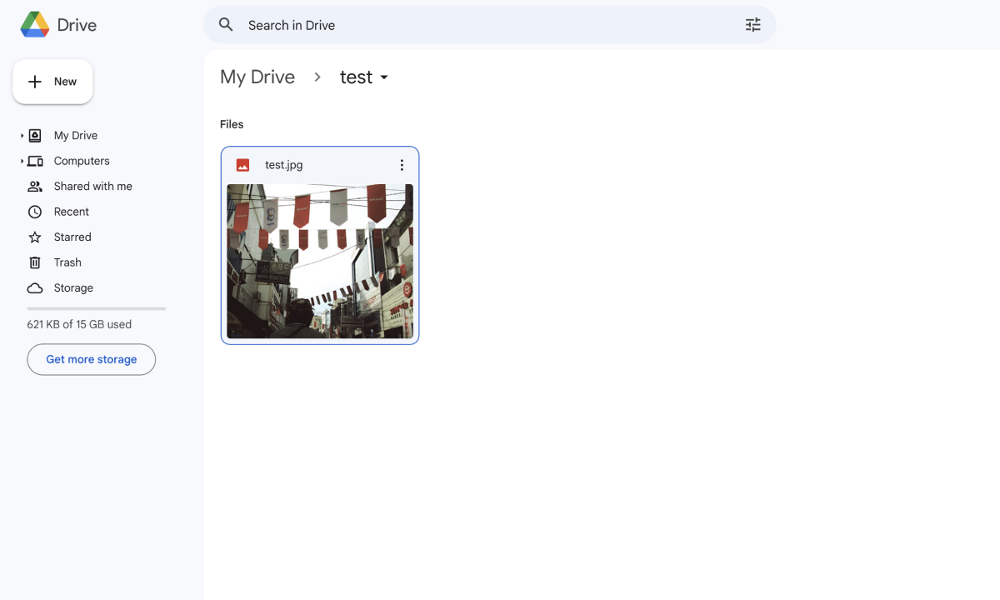
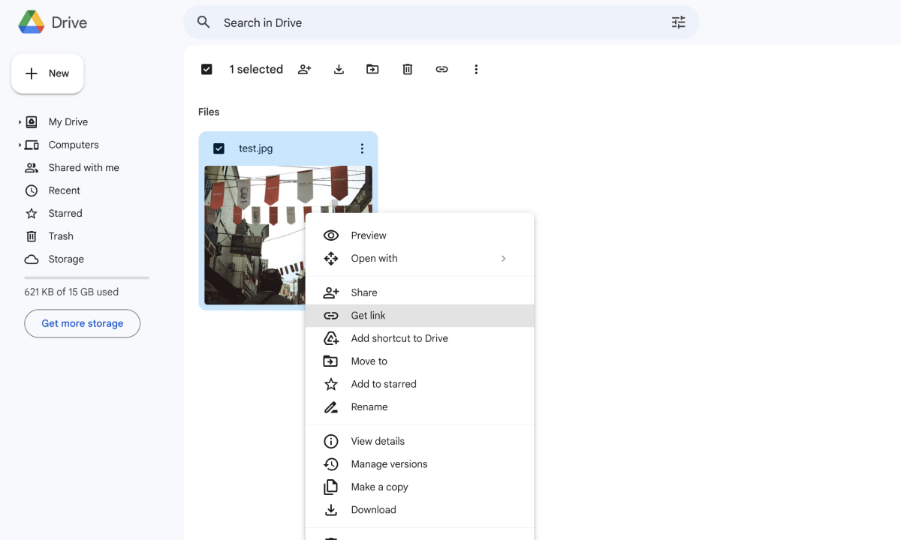
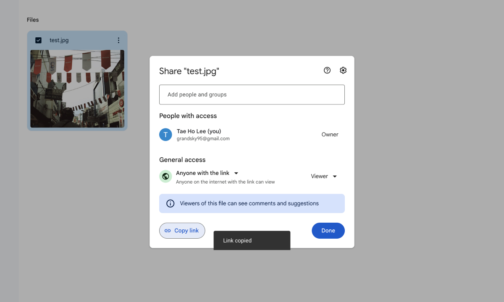

# Google Drive Image Converter

Live Demo : https://taedonn.github.io/gdrive-img-converter

&nbsp;

## How to use 

#### 1. Upload your image to Google Drive.

&nbsp;

#### 2. Right click on your image and click 'Get link'.

&nbsp;

#### 3. Change general access from 'Restricted' to 'Anyone with the link'.

&nbsp;

#### 4. Click on 'Copy link' button to get the url of the image.

&nbsp;

#### 5. Paste the url here and get external link.

